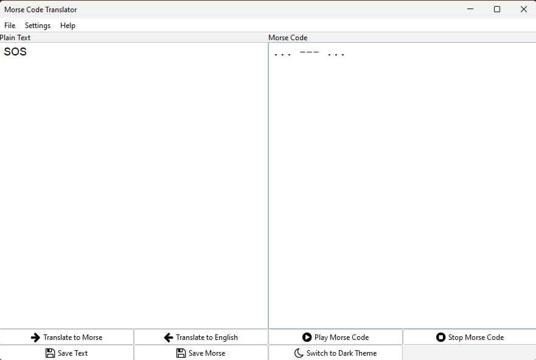
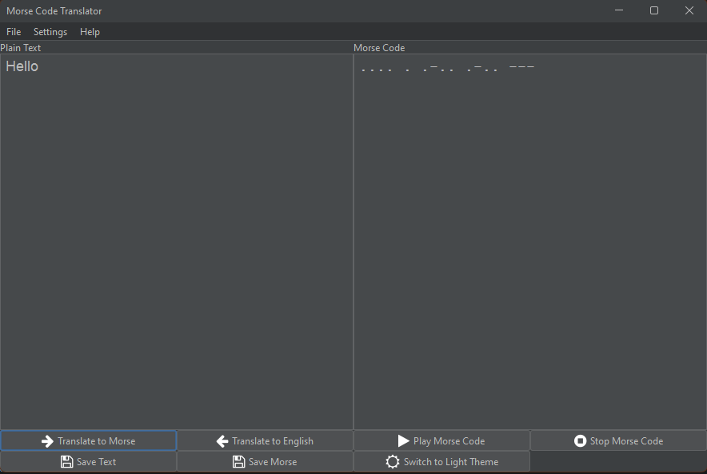
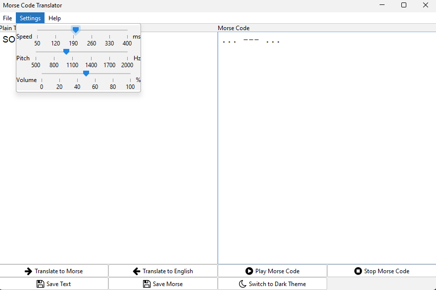
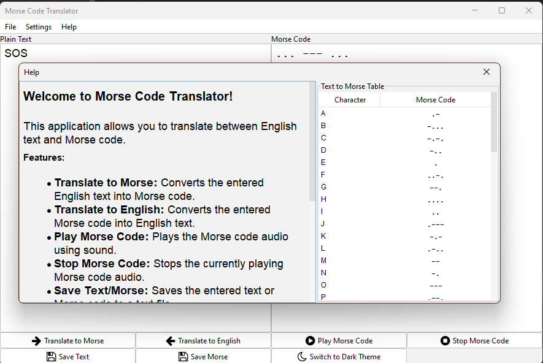
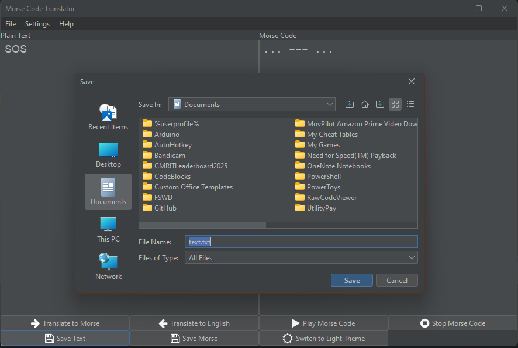

# Morse Code Translator 📡

Morse Code Translator is a Java Swing application that enables users to translate between English text and Morse code. It also supports playing Morse code as audio and saving translated text to files.

## Features ✨

- **Translate to Morse**: Converts English text into Morse code.
- **Translate to English**: Converts Morse code into English text.
- **Play Morse Code**: Plays the Morse code audio.
- **Save Text/Morse**: Saves text or Morse code to a text file.
- **Switch Theme**: Toggles between light and dark themes.

## Screenshots 🖼️

<div style="display: grid; grid-template-columns: repeat(2, 1fr); gap: 10px;">
    
    
    
    
    
</div>

## Usage 🚀

1. **Translate Text**:
   - Enter text in the "Plain Text" area.
   - Click **Translate to Morse** to convert it to Morse code.

2. **Translate Morse Code**:
   - Enter Morse code in the "Morse Code" area.
   - Click **Translate to English** to convert it to English text.

3. **Play Morse Code**:
   - Click **Play Morse Code** to hear the Morse code audio.

4. **Save Files**:
   - Use **Save Text** or **Save Morse** buttons to save content to files.

## Settings ⚙️

Adjust settings like `speed`, `pitch`, and `volume` from the **Settings** menu.

## Technologies Used 🛠️

- Java 
- Swing (GUI framework)
- FlatLaf (Look and Feel)
- JIconFont (FontAwesome icons)

## Installation 🛠️

To run the Morse Code Translator:

1. Clone the repository:
   ```
   git clone https://github.com/dog-broad/MorseCodeTranslator.git
   ```
   
2. Build the project using Maven:
   ```
   mvn clean package
   ```
   
3. Run the application:
   ```
   java -jar target/MorseCodeTranslator.jar
   ```

## Contributing 🤝

Contributions are welcome! Fork the repository and submit a pull request.

## License 📄

This project is licensed under the MIT License - see the [LICENSE](LICENSE) file for details.
